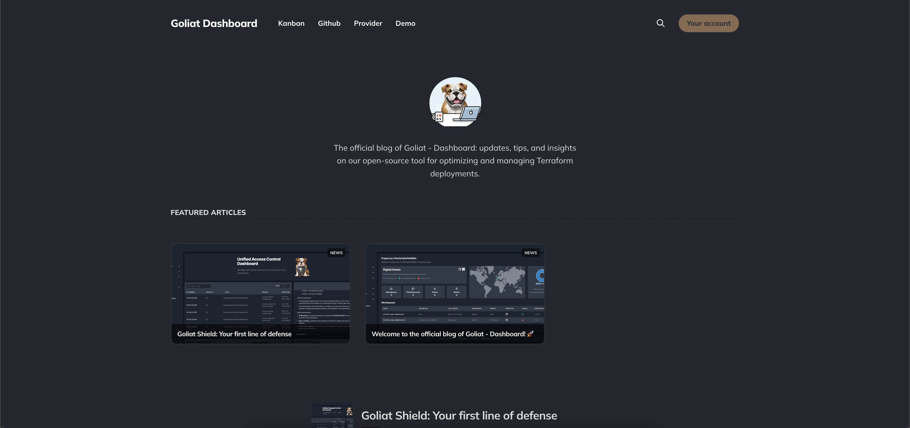

# Goliat Shield Theme

A functional and adaptable theme for [Ghost](https://github.com/TryGhost/Ghost), built on the foundation of the [Dawn](https://github.com/TryGhost/Dawn) theme. This theme has been specially developed for the [Goliat - Dashboard](https://github.com/danieljsaldana/goliat-dashboard) project website, offering users an intuitive way to navigate, search, subscribe, and more.




---

## Installation Instructions

1. [Download the theme here](https://github.com/danieljsaldana/Goliat/archive/refs/heads/main.zip)
2. Log in to your Ghost admin panel, go to the `Design` settings section, and upload the downloaded zip file.

---

## Development

This theme is still under development and is based on modern technologies like Gulp/PostCSS to leverage future CSS specifications. To contribute or make changes, ensure you have the following tools installed:

- [Node.js](https://nodejs.org/)
- [Yarn](https://yarnpkg.com/)
- [Gulp](https://gulpjs.com)

From the theme's root directory, run the following commands:

```bash
# Install dependencies
yarn

# Build and watch for changes
yarn dev
```

You can now edit the files in `/assets/css/`, which will be automatically compiled into `/assets/built/`.

To create a `zip` file ready for upload, use the following command:

```bash
yarn zip
```

The generated file will be located in `dist/goliat.zip`.

---

## Contributions

This repository was created and developed based on the [Dawn](https://github.com/TryGhost/Dawn) theme. If you’d like to contribute to the development of this theme or report issues, please do so through the main repository of the Goliat - Dashboard project on [GitHub](https://github.com/danieljsaldana/goliat-dashboard).

---

## Copyright & License

Copyright (c) 2024 Goliat Project  
Developed using the Dawn theme, owned by Ghost Foundation. Released under the [MIT License](LICENSE).